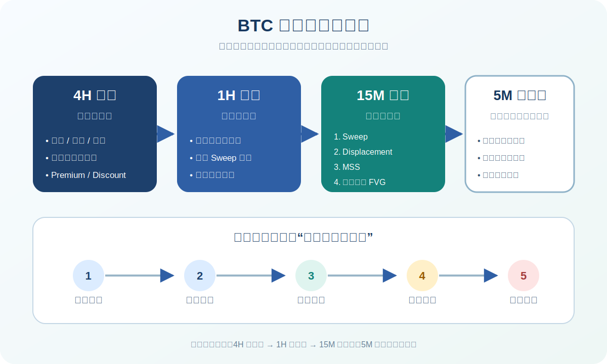

# BTC 多周期与持仓框架 v0.1

本框架参考“不同时间级别 K 线、持仓时长及策略”的资料，并按现有 SMC 执行系统改写。时间周期负责分工，不负责保证某个持仓时长或收益。

## 一、先确定交易类型

| 交易类型 | 方向/环境周期 | 结构/场景周期 | 触发周期 | 参考持仓 | 当前系统定位 |
| --- | --- | --- | --- | --- | --- |
| 头寸 / 长波段 | 1W、1D | 4H | 1H | 数日至数周以上 | 仅学习与观察，暂不纳入核心短线模型 |
| 波段 | 1D、4H | 1H | 15M | 数小时至数日 | 可回测 |
| 日内 | 4H | 1H | 15M | 数十分钟至数小时 | **默认研究框架** |
| 超短线 | 1H、15M | 5M、1M | 1M | 数分钟至一小时 | 噪音和执行成本高，暂不实盘 |

“参考持仓”不是到点强制平仓。实际退出由失效点、目标流动性、时间止损和事件风险共同决定。

## 二、三个周期只做三件事

### 1. 方向 / 环境周期

回答：

- 当前是趋势、区间还是转换环境？
- 上方和下方的外部流动性在哪里？
- 当前价格位于 Dealing Range 的 Premium、Discount 还是中部？
- 哪一侧方向有更清晰的空间与失效条件？

不在这个周期追求精确入场。

### 2. 结构 / 场景周期

回答：

- 价格正在接近哪一个可交易位置？
- 是否出现通道边界、区间边界、收敛三角或高周期 FVG/OB 的共振？
- 如果做多或做空，预期的 Sweep 发生在哪里？
- 哪种路径会使场景在触发前直接失效？

场景周期负责“等什么”，不是“现在就下单”。

### 3. 触发周期

只接受预先定义的序列：

`关键位置 → Sweep → Displacement → MSS → 首次回踩位移 FVG → 风险受控执行`

如果只有影线、FVG、BOS、通道线或三角形突破之一，不构成完整触发。

## 三、默认日内模型：4H → 1H → 15M

### 4H：定环境与目标

- 标注最近明确 Swing High / Swing Low。
- 判断趋势、区间或转换。
- 标注两侧外部流动性和主要目标。
- 若价格处在区间中部，默认观望。

### 1H：定位置与场景

- 标注当天可能发生反应的支撑/压力、FVG、OB、通道或区间边界。
- 写出多头场景、空头场景和禁做条件。
- 场景必须包含“价格先到哪里、扫哪侧、怎样失效”。

### 15M：等触发与执行

- 等 Sweep 后的明显位移。
- 等位移破坏近端结构并形成 MSS。
- 只考虑首次回踩位移产生的 FVG。
- 止损放在逻辑失效点之外，按风险比例反推仓位。

### 5M：只作可选精细化

- 仅在 15M 已形成完整触发、且 5M 能缩小止损而不改变失效逻辑时使用。
- 5M 不得反过来否定 4H/1H 环境，也不能凭“看起来快突破”提前追单。
- 至少完成 100 个 15M 样本前，不单独建立 5M 实盘模型。

## 四、常规形态如何接入 SMC

### 通道跌破回抽空

1. 4H/1H 出现可重复连接的上升通道。
2. 价格接近上方流动性或高周期压力区。
3. 15M 有效跌破通道后回抽原边界。
4. 回抽承压的同时，最好出现下扫/上扫后的 Displacement 与 MSS。
5. 止损在回抽结构高点外，目标先看最近内部低点，再看外部卖方流动性。

做多镜像处理：下降通道突破、回踩站稳、低周期多头 MSS。

### 收敛三角

1. 1H 标注不断收窄的上下边界。
2. 不预判方向，也不在三角形中部交易。
3. 15M 等收盘与位移确认越界。
4. 优先等待回测边界或回补位移 FVG，而不是裸追第一根突破 K 线。
5. 假突破扫流动性后反向 MSS，可作为反向场景候选，但仍需完整触发。

## 五、持仓管理

### 退出优先级

1. **逻辑失效**：达到止损或结构失效，立即退出。
2. **目标到达**：目标流动性被触及或价格进入计划目标区。
3. **时间止损**：触发后在预设窗口内没有位移延续，减仓或退出。
4. **事件风险**：重大事件前是否持仓，必须在入场前决定。
5. **交易时段结束**：日内模型不因“想等回本”自动变成波段。

### 禁止事项

- 用更小周期不断寻找理由，拖延高周期失效后的止损。
- 把“数小时至一天”理解为必须隔夜。
- 用固定“100–200 点”止盈止损；应按结构、波动率和账户风险计算。
- 看到短周期突破就追单，忽略点差、滑点、手续费与 Funding。
- 同一笔交易中途更换交易类型，且不重新定义风险。

## 六、盘前最小检查

- [ ] 今天做的是波段、日内还是仅观察？
- [ ] 方向周期、场景周期、触发周期分别是什么？
- [ ] 高周期是趋势、区间还是转换？
- [ ] 两侧流动性和当前位置已标注？
- [ ] 多空场景与禁做条件已写明？
- [ ] 触发必须包含 Sweep、Displacement、MSS 与首次回踩？
- [ ] 止损、目标、计划 RR 和建议仓位已计算？
- [ ] 若条件未齐，是否能接受整天不交易？

