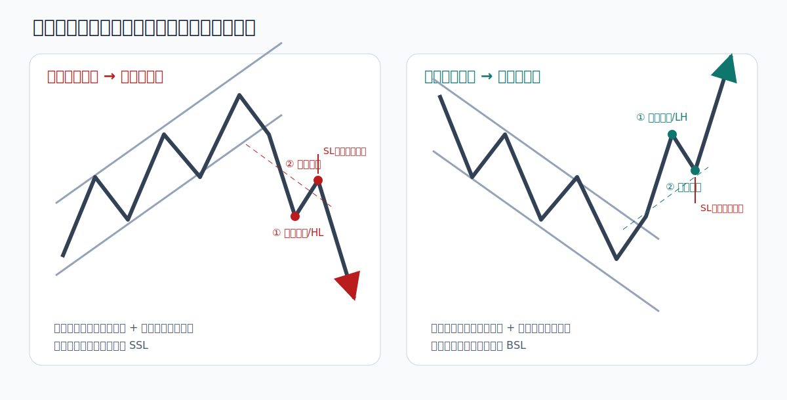
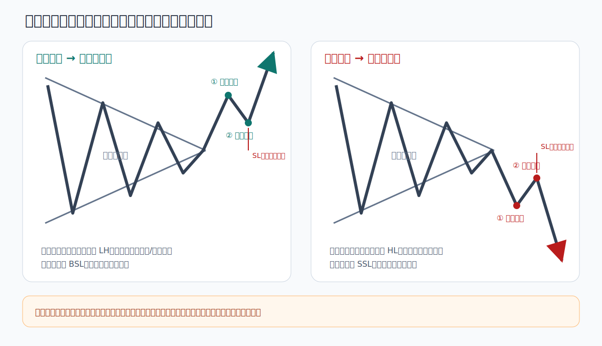
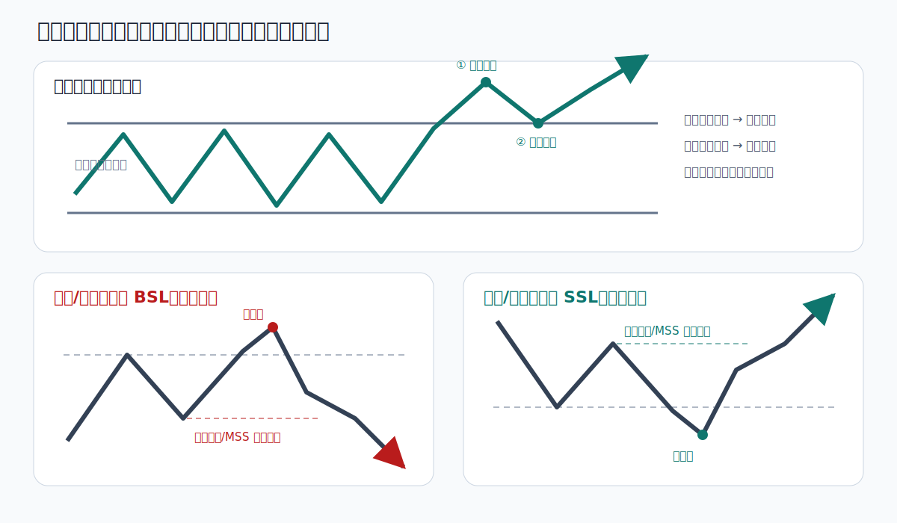

# 常规价格结构图谱

常规技术形态与 SMC 并不冲突。通道、三角形、区间和双顶双底描述的是价格外观；流动性、位移和结构转换用于判断形态是否真正完成。

核心原则：

> 先等形态突破，再观察市场是否接受突破，最后等待回踩或回抽确认。

## 1. 上升通道跌破与下降通道突破



### 上升通道跌破做空

1. 高低点沿两条近似平行边界抬高。
2. 价格以实体和位移跌破通道下轨。
3. 最好同时跌破最近受保护 HL。
4. 回抽下轨、旧 HL、FVG 或供应区域时承压。
5. 止损位于回抽高点或重新进入通道的失效位置之外。
6. 目标选择前低、等低或外部 SSL。

只有影线跌破、随后迅速回到通道内，不视为有效空头触发。

### 下降通道突破做多

完全反向：实体突破通道上轨；同时突破最近 LH 更佳；回踩上轨或需求区域获得支撑；止损放在回踩低点或重新跌回通道的失效位置之外；目标选择前高、等高或外部 BSL。

## 2. 收敛三角



收敛三角由越来越低的高点和越来越高的低点构成，代表波动压缩，并不提前决定方向。

执行规则：

1. 三角中部不交易。
2. 等待实体收盘和位移离开边界。
3. 向上突破最好同步突破邻近 LH；向下跌破最好同步跌破邻近 HL。
4. 等待首次回踩或回抽边界。
5. 回到三角内部并持续成交，说明突破失败。
6. 目标优先选择外部流动性，三角高度量度目标只作辅助参考。

进一步分类：

- 对称三角：高点降低、低点抬高，方向中性。
- 上升三角：顶部接近水平、低点抬高，关注上方 BSL，但仍需等待突破。
- 下降三角：底部接近水平、高点降低，关注下方 SSL，但仍需等待跌破。

## 3. 水平区间、双顶与双底



### 区间突破回踩

- 上破阻力并在区间外接受，回踩阻力转支撑后研究多单。
- 下破支撑并在区间外接受，回抽支撑转压力后研究空单。
- 区间中部没有明显失效点，默认不交易。
- 刺破边界后迅速收回，先按 Sweep 研究，而不是追突破。

### 双顶与双底

- 双顶不是看到两个高点就做空；先观察是否扫 BSL，再等待向下 MSS。
- 双底不是看到两个低点就做多；先观察是否扫 SSL，再等待向上 MSS。
- 颈线突破可以作为结构确认，但最好有位移。
- 没有确认时，形态可能继续演变为区间或趋势延续。

## 4. 形态与 SMC 的统一判断顺序

```text
高周期环境
→ 形态所在位置
→ 边界外的流动性
→ 突破或 Sweep
→ Displacement / MSS
→ 回踩或回抽
→ 失效点与目标
```

形态名称只用于分类样本，不能代替入场确认。
