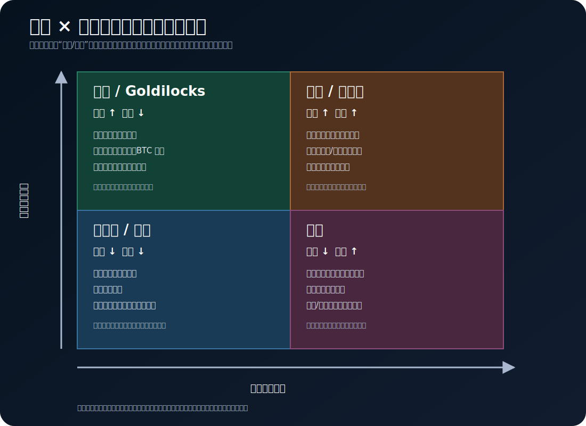

# 世界经济的基本运行逻辑

## 1. 用程序员的方式理解经济

可以把现代经济看成一个有状态、有反馈、有时滞的分布式系统：

- **节点**：家庭、企业、银行、政府、央行、海外部门。
- **状态**：资产、负债、收入、库存、就业、产能、价格。
- **消息**：订单、工资、贷款、税收、政府支出、利率和预期。
- **共识机制**：法律、合同、货币和支付清算体系。
- **反馈回路**：收入增加促进支出；支出增加促进收入。反向也成立。
- **限流器**：产能、劳动力、能源、信用额度、抵押品和政策约束。

经济不是一台由单个变量控制的机器。它有非线性、反身性和长短不一的延迟，因此“数据好/坏”不等于“资产涨/跌”。

## 2. 每笔金融资产都是另一方的负债或权益

理解宏观的起点是资产负债表：

- 你的银行存款是你的资产，也是银行的负债。
- 银行贷款是借款人的负债，也是银行的资产。
- 国债是投资者的资产，也是政府的负债。
- 股票是持有人的权益性资产，代表对企业剩余现金流的索取权。
- 黄金和 BTC 不是某个发行人的负债，这是它们与债券、存款的关键区别。

交易发生时，金融资产通常只是换了持有人；真正改变总量和风险分布的是新信贷、违约、财政赤字、资产发行和资产负债表扩张/收缩。

## 3. 实体经济的循环

家庭提供劳动并获得工资，企业销售商品并获得收入，政府征税和支出，银行把储蓄与信用需求连接起来。

支出法 GDP 恒等式：

`GDP = C + I + G + NX`

- `C`：居民消费。
- `I`：私人投资，包括设备、建筑和库存变化。
- `G`：政府消费和投资，不等于所有财政支出；转移支付本身不直接计入 GDP。
- `NX`：净出口，即出口减进口。

GDP 衡量一段时间内境内最终产品和服务的增加值，不是财富总量，也不直接衡量分配、生活质量或金融资产涨跌。

## 4. 名义量、实际量和价格

名义增长可以来自“产量更多”，也可以来自“价格更高”：

`名义增长 ≈ 实际增长 + 通胀`

严格计算需要连乘而非简单相加，但小幅变化时近似足够。分析时必须问：

- 销售额增长是销量增长还是涨价？
- 工资增长是否跑赢通胀？
- 债券收益率上升来自实际利率、通胀预期还是期限溢价？

## 5. 储蓄、投资与信用

储蓄不是从系统中消失的钱，而是没有用于当期消费的收入。金融体系把不同主体的储蓄、融资需求和期限偏好连接起来。

信用的作用是把未来购买力搬到今天：

1. 借款增加当期支出能力。
2. 支出成为另一方收入。
3. 若投资提高未来现金流，债务可持续。
4. 若收入没有跟上，偿债会挤压未来支出。
5. 去杠杆会形成“支出下降—收入下降—违约上升—信贷更紧”的负反馈。

所以信用增长常领先经济活动，但“更多债务”既可能融资生产性投资，也可能只抬高资产价格。

## 6. 经济周期的四个常见阶段

| 阶段 | 增长 | 通胀 | 常见政策倾向 | 市场关注 |
|---|---|---|---|---|
| 复苏 | 加速 | 较低或回升 | 仍偏宽松 | 盈利改善、风险偏好 |
| 过热 | 高位 | 上升 | 收紧 | 通胀、加息、估值压力 |
| 滞胀/放缓 | 下降 | 仍高 | 两难 | 利润率、能源、信用风险 |
| 衰退/去通胀 | 负或很弱 | 下降 | 转向宽松 | 违约、失业、政策救助 |

真实世界不会整齐切换。增长和通胀还要看“水平、方向、变化速度以及相对预期”。

## 7. 为什么“预期”比数据绝对值更重要

金融市场定价未来现金流和未来政策路径。价格变化通常来自：

`新信息 − 已经计入价格的预期`

例如 CPI 仍然很高，但低于市场预期，债券收益率可能下跌；就业增长仍为正，但连续下修，市场可能交易衰退。分析事件前必须记录一致预期、仓位是否拥挤和关键阈值。

## 8. 三条核心传导链

### 需求链

`收入/信用/财政支出 ↑ → 总需求 ↑ → 企业收入与就业 ↑ → 供给跟不上时通胀 ↑`

### 利率链

`政策预期更紧 → 无风险利率与融资成本 ↑ → 折现率 ↑、需求放缓 → 高估值和高杠杆资产承压`

### 风险链

`冲击 → 波动和保证金需求 ↑ → 去杠杆/抢现金 → 美元融资趋紧 → 跨资产相关性暂时升高`

这三条链可能同时存在且方向相反。宏观研究的任务不是寻找单一答案，而是判断哪条链当前占主导。
