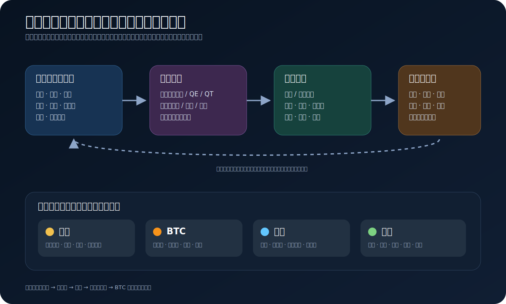

# 宏观金融基础

这一模块不是为了预测每一根 K 线，而是建立一张能持续修正的“世界运行地图”：

`生产与收入 → 消费与投资 → 通胀与就业 → 财政/货币政策 → 利率、美元、信用与流动性 → 资产定价`

对 BTC 交易而言，宏观主要回答三个问题：

1. 当前环境更鼓励持有现金，还是承担风险？
2. 市场正在交易增长、通胀，还是金融稳定风险？
3. 未来政策路径相对市场预期是更宽松，还是更紧？

宏观只能提供背景和情景权重，不能替代价格结构、入场触发和风险管理。

## 推荐阅读顺序

1. [世界经济的基本运行逻辑](01_世界经济的基本运行逻辑.md)
2. [货币、银行、财政与美联储](02_货币银行财政与美联储.md)
3. [通胀、就业、增长与宏观数据](03_通胀就业增长与宏观数据.md)
4. [美元、美元指数与全球美元体系](04_美元美元指数与全球美元体系.md)
5. [债券、利率与收益率曲线](05_债券利率与收益率曲线.md)
6. [黄金、BTC、美股与原油](06_黄金BTC美股与原油.md)
7. [流动性、信用与跨资产传导](07_流动性信用与跨资产传导.md)
8. [宏观观察框架与交易连接](08_宏观观察框架与交易连接.md)
9. [常见误区与学习路线](09_常见误区与学习路线.md)
10. [一手数据与资料入口](参考资料.md)

## 三种信息必须分开

| 类型 | 含义 | 示例 |
|---|---|---|
| 恒等式/定义 | 在统计或会计口径下成立 | `GDP = C + I + G + NX` |
| 因果模型 | 有机制、有条件，但存在时滞和反馈 | 加息通常通过金融条件压低总需求 |
| 经验倾向 | 历史上常见，不保证重复 | 实际利率下降往往对黄金有利 |

每次写宏观判断时，至少写出：当前状态、市场原先预期、新信息、传导路径、反例和失效条件。

> 本模块用于学习和研究，不构成投资建议。宏观关系会随制度、仓位、估值和市场主线变化。
