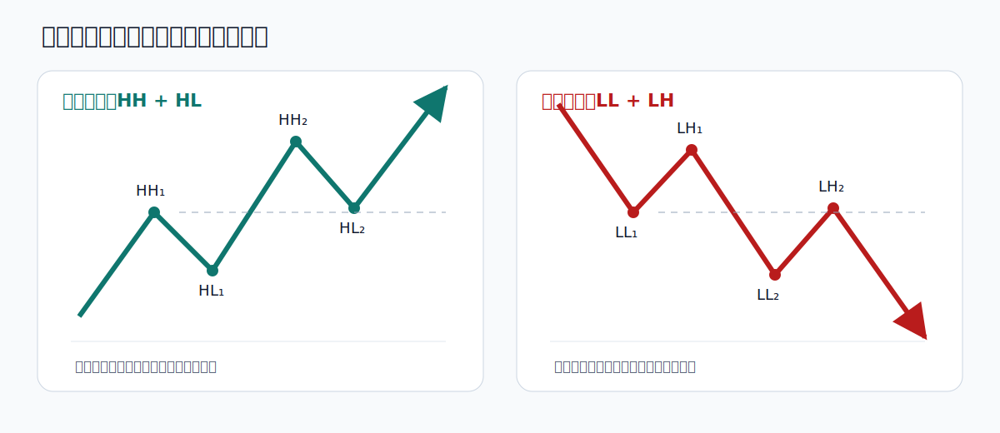
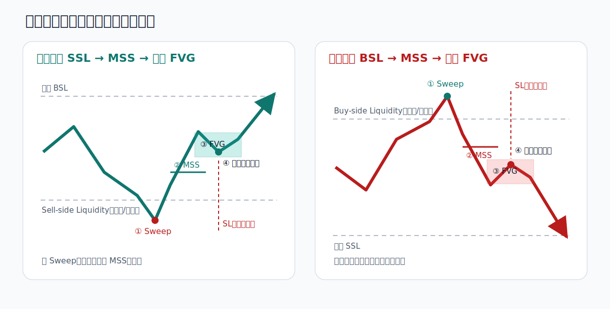

# BTC SMC 图解索引

本页用于快速浏览系统中的标准示意图。图形只用于说明识别顺序，不代表价格必须复制相同路径。

## 市场结构

对应规则：`02_概念库/SMC核心概念.md`

## SMC 核心入场模型

对应规则：`01_交易系统/交易系统规则_v0.1.md`

## 通道跌破/突破回踩

## 收敛三角

## 区间、双顶与双底

详细定义：`02_概念库/常规价格结构.md`

执行规则：`01_交易系统/常规结构执行规则_v0.1.md`
